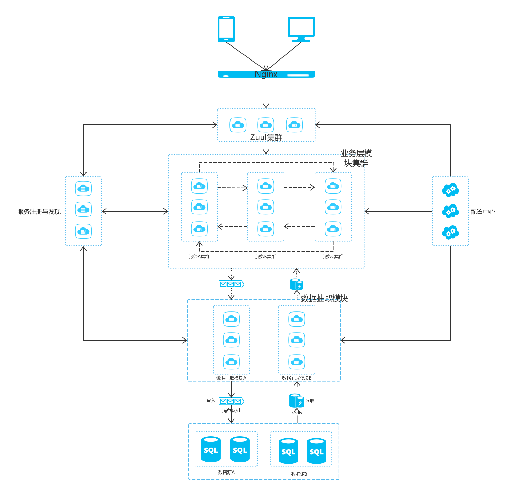

# DataStone项目简介 #	
## 前言 ##
为符合正常的软件开发流程，符合项目开发逻辑的编码顺序，该简介在初期保证项目可coding的条件下，逐步添加SpringCloud相关的组件和模块功能，重点侧重于功能点的实现以及整体项目的高可用性、扩展性等。 
**截至目前，项目中包含的模块有：**

| 序号   |      服务名称      |  服务端口 |功能|
|----------|:-------------:|------:|------:|
| 1  |  datastone-eureka-server | 8110 |服务注册与发现|
| 2  |  datastone-mysql-client  | 8120 |Mysql数据抽取 |
| 3  |  datastone-user-service  | 8130 |针对业务的服务 |
| 4  |  datastone-zuul-router   | 8140 |路由         |
| 5  |  datastone-config-center | 8150 |配置中心     |
| 6  |  datastone-dynamic-datasources | 8160 | 多数据源、读写分离等|

**截至目前，包含的相关功能有：**

1. 服务注册与发现
2. 单体数据源模块
3. 动态切换数据源模块（开发阶段假如数据库条件不具备不建议读写分离）
4. MyBatis
5. Hystrix熔断器（开发阶段不建议使用，后期统一使用）
6. restTemplate负载均衡
7. zuul路由
8. 统一的服务配置中心（即插即用，建议测试阶段使用）
9. redis缓存（建议缓存只加在业务模块）
10. rabbitmq消息队列(建议缓存只加在业务模块)
11. swagger2 RestApi可视化

## 运行 ##

1. 初始化数据库： sql文件夹下test.sql
2. 将每个模块中resources文件中的application.yml相关配置改为本地
3. 首先关闭编辑器对各个模块单例限制
4. 运行 datastone-eureka-server 中 EurekaServerApplication的main方法,运行完毕可访问 [http://localhost:8100/](http://localhost:8100/)即可访问服务注册界面。
5. 运行 datastone-mysql-client 中 MysqlClientApplication的main方法,运行完毕可访问 ：  xml格式 -- [http://192.168.16.25:8120/user/getUserById?id=1](http://192.168.16.25:8120/user/getUserById?id=1)    json格式 -- [http://192.168.16.25:8120/user/getUserById.json?id=1](http://192.168.16.25:8120/user/getUserById.json?id=1) 
6. 运行 datastone-dynamic-datasources 中 DynamicDataSourcesApplication方法，运行完毕可访问： [http://192.168.16.25:8180/dynamic/getAllStudent](http://192.168.16.25:8180/dynamic/getAllStudent) 注 ：需要postgresql,没有可更换，或者暂时不用这个模块，建议数据模块采用该种形式，方便后续需要读写分离时代码的调整
7. 运行 datastone-user-service 中 UserServiceApplication的main方法,运行完毕可以访问 : [http://192.168.16.25:8130/user/getUserById?id=1](http://192.168.16.25:8130/user/getUserById?id=1)  RestApi接口可视化 ：[http://192.168.16.25:8130/swagger-ui.html](http://192.168.16.25:8130/swagger-ui.html) (尚未详细配置，可发现自己的接口，可展示api参数、在线调试接口等)
8. 运行 datastone-zuul-router 中 ZuulRouterApplication的main方法，运行完毕可查看路由效果 ： 路由到user-service接口 [http://192.168.16.25:8140/record/user/getUserById?id=1](http://192.168.16.25:8140/record/user/getUserById?id=1) 路由到user-service模块的Api界面 ： [http://192.168.16.25:8140/record/swagger-ui.html](http://192.168.16.25:8140/record/swagger-ui.html)(其他模块路由同理)

**以上步骤均未体现出负载均衡,负载均衡主要表现在nginx请求分发、zuul请求分发、restTemplate对实例的选择。** 
**注 ： 模块均为开发环境下的单实例状态，线上环境或者测试环境需要将模块集群化。**

**部署框架：**

